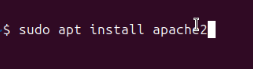

 ⚙️ Configuración del entorno LAMP (Linux, Apache, MySQL, PHP)
  Este documento detalla el proceso para instalar y verificar el funcionamiento de los servicios Apache, MySQL y PHP en un sistema Linux.

  📋 Resumen general
  
    
      🔧 Servicio
      💻 Comando de instalación
      ✅ Verificación
    
    
      Apache
      sudo apt install apache2
      "http://localhost">Abrir localhost
    
    
      MySQL
      sudo apt install mysql-server
      sudo mysql
    
    
      PHP
      sudo apt install php libapache2-mod-php php-mysql
      php -v
    
    
      Reiniciar Apache
      sudo systemctl restart apache2
      sudo systemctl status apache2
    
  

  🌐 Instalación de Apache
  Para instalar Apache, ejecuta el siguiente comando:
  sudo apt install apache2
  
  Para confirmar que funciona correctamente, abre tu navegador y escribe:
  http://localhost
  (./imgs/img2.png)
  Si se muestra la página de inicio de Apache, la instalación fue exitosa.

  🗄️ Instalación de MySQL
  Instalamos MySQL utilizando:
  sudo apt install mysql-server
  (./imgs/img3.png)
  Accedemos a la consola de MySQL para verificar que funcione:
  sudo mysql
  (./imgs/img4.png)
  Si entras sin errores, la instalación fue correcta. Para salir del entorno:
  exit;

  🧮 Instalación de PHP
  Instalamos PHP junto con los módulos necesarios para Apache y MySQL:
  sudo apt install php libapache2-mod-php php-mysql
  (./imgs/img5.png)
  Comprobamos la versión instalada con:
  php -v
  (./imgs/img6.png)

  🔁 Reinicio de Apache
  Reiniciamos Apache para que los cambios se apliquen:
  sudo systemctl restart apache2 && sudo systemctl status apache2
  (./imgs/img7.png)
  (./imgs/img8.png)
  ✅ El entorno LAMP ya está instalado y listo para usar en proyectos web.

  🌍 Creación de un host virtual para tu sitio
  Creamos el directorio donde alojaremos el sitio web:
  sudo mkdir /var/www/your_domain
  (./imgs/img9.png)

  Asignamos los permisos correspondientes al usuario actual:
  sudo chown -R $USER:$USER /var/www/your_domain

  Creamos el archivo de configuración del nuevo host virtual:
  sudo nano /etc/apache2/sites-available/your_domain.conf
  Esto abrirá un archivo en blanco.
  (./imgs/img10.png)
  (./imgs/img11.png)

  Habilitamos el nuevo sitio con:
  sudo a2ensite your_domain.conf
  (./imgs/img12.png)

  Desactivamos el sitio por defecto que incluye Apache:
  sudo a2dissite 000-default.conf
  (./imgs/img13.png)

  Comprobamos que la configuración no contenga errores:
  sudo apache2ctl configtest
  (./imgs/img14.png)

  Recargamos Apache para aplicar los cambios:
  sudo systemctl reload apache2
  (./imgs/img15.png)

  Creamos un archivo de prueba para comprobar que el host virtual funciona:
  sudo nano /var/www/your_domain/index.html
  (./imgs/img16.png)
  (./imgs/img17.png)

  Por último, abrimos el navegador y accedemos al dominio o IP configurada:
  http://your_domain
  (./imgs/img18.png)
  ✅ ¡Tu nuevo sitio web está activo y funcionando correctamente bajo Apache!

