
Ejercicio 6: Práctica Servidor Web (1º Trimestre)

Guía paso a paso para instalar y configurar un servidor web en Ubuntu. Se montan Apache con WordPress, una aplicación Python usando mod_wsgi, estadísticas con AWStats y un segundo servidor Nginx en el puerto 8080 con PHP y phpMyAdmin. Se incluyen comandos, rutas, capturas y comprobaciones.

 

Entorno y requisitos

Sistema operativo: Ubuntu Server o Desktop (recomendado 22.04 o 24.04) 
Usuario con permisos sudo 
Navegador para probar: Firefox o Chrome 
Dominios internos en /etc/hosts: centro.intranet, departamentos.centro.intranet, servidor2.centro.intranet

 

Carpetas del repositorio: 
docs/ para documentación y apuntes 
images/ para capturas de pantalla

 

0) Preparar el sistema

Actualiza el sistema y las herramientas básicas:

sudo apt update && sudo apt -y upgrade 
sudo apt -y install curl wget unzip git

 

 
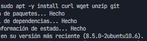

 

1) Configuración de dominios locales

Edita el archivo /etc/hosts:

sudo nano /etc/hosts

 

Añade al final del archivo: 
127.0.0.1   centro.intranet 
127.0.0.1   departamentos.centro.intranet 
127.0.0.1   servidor2.centro.intranet

 

Guarda y cierra con CTRL+O y CTRL+X.

 

Comprobación:

ping -c 1 centro.intranet 
ping -c 1 departamentos.centro.intranet 
ping -c 1 servidor2.centro.intranet

 

 
 
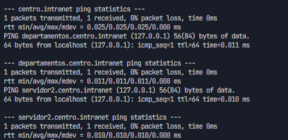

 

2) Instalar Apache y crear la estructura de los sitios

Instalación de Apache y herramientas:

sudo apt -y install apache2 apache2-utils

 

Crear carpetas para los sitios:

sudo mkdir -p /var/www/centro.intranet 
sudo mkdir -p /var/www/departamentos.centro.intranet

 

Permisos:

sudo chown -R www-data:www-data /var/www/centro.intranet /var/www/departamentos.centro.intranet 
sudo chmod -R 755 /var/www

 

Verificar estado de Apache:

sudo systemctl status apache2 --no-pager

 

 
 
 
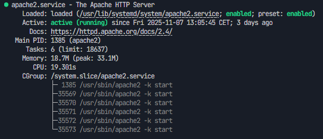

 

3) Activar PHP y MySQL

Instalar PHP y MySQL:

sudo apt -y install libapache2-mod-php php php-mysql php-cli php-curl php-xml php-gd 
sudo apt -y install mysql-server

 

Seguridad básica de MySQL:

sudo mysql_secure_installation

 

Reiniciar Apache:

sudo systemctl restart apache2

 

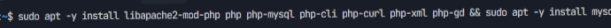 
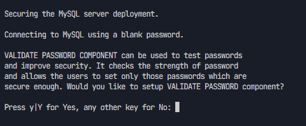 

 

4) Configurar VirtualHosts en Apache

Se crearán dos sitios: centro.intranet y departamentos.centro.intranet.

 

4.1) VirtualHost de centro.intranet

sudo nano /etc/apache2/sites-available/centro.intranet.conf

 

&lt;VirtualHost *:80&gt; 
ServerName centro.intranet 
DocumentRoot /var/www/centro.intranet  
&lt;Directory /var/www/centro.intranet&gt; 
AllowOverride All 
Options Indexes FollowSymLinks 
Require all granted 
&lt;/Directory&gt;  
ErrorLog ${APACHE_LOG_DIR}/centro_error.log 
CustomLog ${APACHE_LOG_DIR}/centro_access.log combined 
&lt;/VirtualHost&gt;

 

 
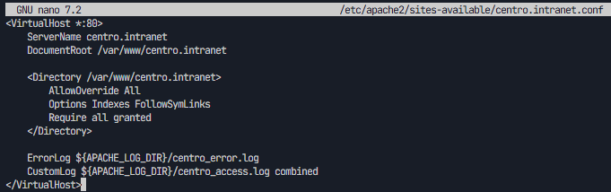

 

4.2) VirtualHost de departamentos.centro.intranet

sudo nano /etc/apache2/sites-available/departamentos.centro.intranet.conf

 

&lt;VirtualHost *:80&gt; 
ServerName departamentos.centro.intranet 
DocumentRoot /var/www/departamentos.centro.intranet  
WSGIDaemonProcess departamentos user=www-data group=www-data threads=5 
WSGIProcessGroup departamentos 
WSGIScriptAlias / /var/www/departamentos.centro.intranet/wsgi.py  
&lt;Directory /var/www/departamentos.centro.intranet&gt; 
Require all granted 
&lt;/Directory&gt;  
ErrorLog ${APACHE_LOG_DIR}/departamentos_error.log 
CustomLog ${APACHE_LOG_DIR}/departamentos_access.log combined 
&lt;/VirtualHost&gt;

 

Habilitar sitios y módulos:

sudo a2ensite centro.intranet.conf departamentos.centro.intranet.conf 
sudo a2enmod rewrite 
sudo systemctl reload apache2

 

 
 
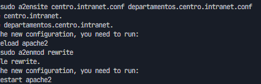

 

5) Instalación de WordPress en centro.intranet

5.1) Crear base de datos y usuario:

sudo mysql

 

CREATE DATABASE wordpress CHARACTER SET utf8mb4 COLLATE utf8mb4_unicode_ci; 
CREATE USER 'wpuser'@'localhost' IDENTIFIED BY 'wp_password_seguro'; 
GRANT ALL PRIVILEGES ON wordpress.* TO 'wpuser'@'localhost'; 
FLUSH PRIVILEGES; 
EXIT;

 

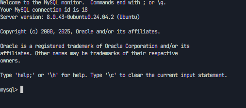 
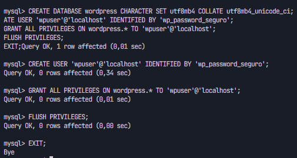

 

5.2) Descargar WordPress y preparar DocumentRoot:

cd /tmp 
wget https://wordpress.org/latest.zip 
unzip latest.zip 
sudo rsync -avP wordpress/ /var/www/centro.intranet/

 

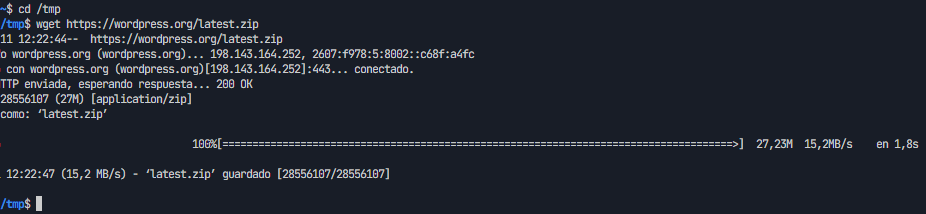

 

5.3) Configurar wp-config.php:

cd /var/www/centro.intranet 
sudo cp wp-config-sample.php wp-config.php 
sudo nano wp-config.php

 

define('DB_NAME', 'wordpress'); 
define('DB_USER', 'wpuser'); 
define('DB_PASSWORD', 'wp_password_seguro'); 
define('DB_HOST', 'localhost');

 

Permisos: 
sudo chown -R www-data:www-data /var/www/centro.intranet 
sudo find /var/www/centro.intranet -type d -exec chmod 755 {} \; 
sudo find /var/www/centro.intranet -type f -exec chmod 644 {} \;

 

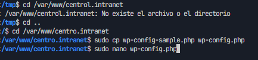 
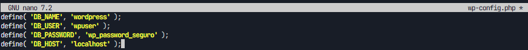 
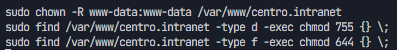 
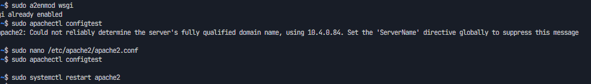 
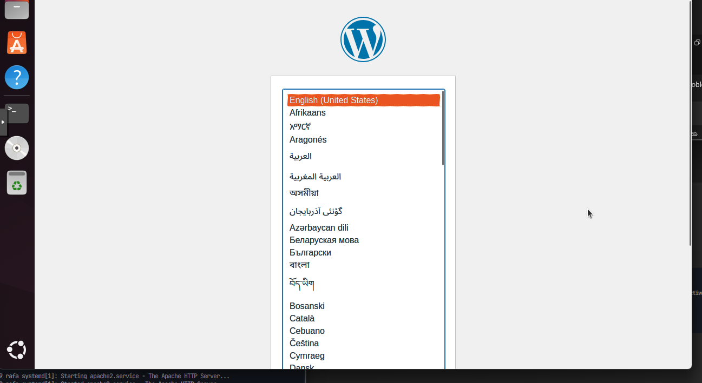

 

6) Activar mod_wsgi y desplegar app Python en departamentos.centro.intranet

sudo apt -y install libapache2-mod-wsgi-py3 python3-venv 
sudo a2enmod wsgi 
sudo systemctl restart apache2

 

Crear aplicación mínima:

sudo bash -c 'cat &gt; /var/www/departamentos.centro.intranet/app.py' &lt;&lt; 'EOF' 
def application(environ, start_response): 
    status = '200 OK' 
    headers = [('Content-Type', 'text/html; charset=utf-8')] 
    start_response(status, headers) 
    body = [b"&lt;h1&gt;Aplicación Python OK&lt;/h1&gt;", 
            b"&lt;p&gt;Ruta: %s&lt;/p&gt;" % environ.get('PATH_INFO', '/').encode('utf-8')] 
    return body 
EOF

 

sudo bash -c 'cat &gt; /var/www/departamentos.centro.intranet/wsgi.py' &lt;&lt; 'EOF' 
import sys 
sys.path.insert(0, '/var/www/departamentos.centro.intranet') 
from app import application 
EOF

 

sudo chown -R www-data:www-data /var/www/departamentos.centro.intranet

 

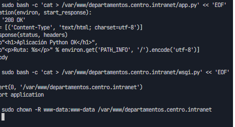 
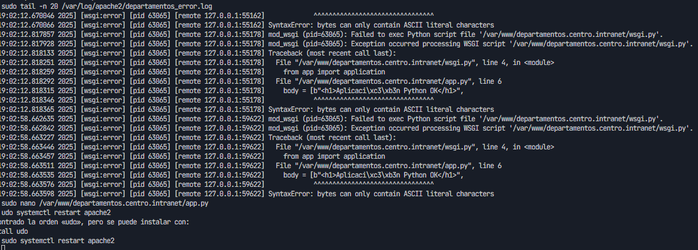 
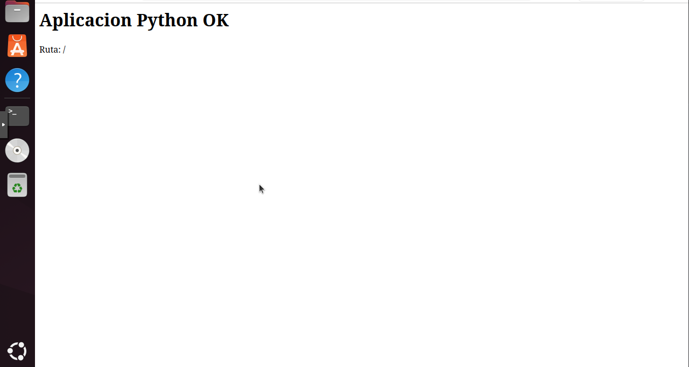

 

6.2) Protección con autenticación HTTP básica

sudo apt -y install apache2-utils 
sudo htpasswd -c /etc/apache2/.htpasswd profesor

 

Editar VirtualHost para restringir acceso:

&lt;Directory /var/www/departamentos.centro.intranet&gt; 
AuthType Basic 
AuthName "Acceso restringido" 
AuthUserFile /etc/apache2/.htpasswd 
Require valid-user 
&lt;/Directory&gt;

 

sudo systemctl reload apache2

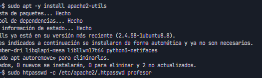 
 
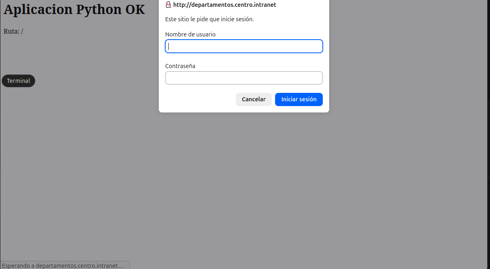

 

7) Instalar y configurar AWStats

sudo apt -y install awstats 
sudo a2enmod cgi 
sudo a2enconf awstats 
sudo systemctl reload apache2

 

Crear configuración específica del sitio:

sudo cp /etc/awstats/awstats.conf /etc/awstats/awstats.centro.intranet.conf 
sudo nano /etc/awstats/awstats.centro.intranet.conf

 

LogFile="/var/log/apache2/centro_access.log" 
SiteDomain="centro.intranet" 
HostAliases="localhost 127.0.0.1 www.centro.intranet" 
LogFormat=1

 

Actualizar estadísticas iniciales: 
sudo /usr/lib/cgi-bin/awstats.pl -config=centro.intranet -update

 

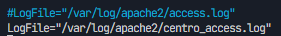 
 
 
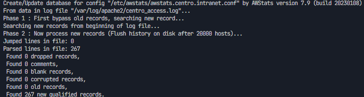 

 

8) Segundo servidor: Nginx en puerto 8080 con PHP y phpMyAdmin

sudo apt -y install nginx php-fpm php-mysql

 

Crear DocumentRoot y PHP info:

sudo mkdir -p /var/www/servidor2.centro.intranet 
echo "&lt;?php phpinfo(); ?&gt;" | sudo tee /var/www/servidor2.centro.intranet/info.php 
sudo chown -R www-data:www-data /var/www/servidor2.centro.intranet

 

Configurar Nginx en puerto 8080 (sites-available/servidor2.centro.intranet)

 

sudo ln -s /etc/nginx/sites-available/servidor2.centro.intranet /etc/nginx/sites-enabled/ 
sudo nginx -t 
sudo systemctl reload nginx

 

Acceso a PHP info: 
http://servidor2.centro.intranet:8080/info.php

 

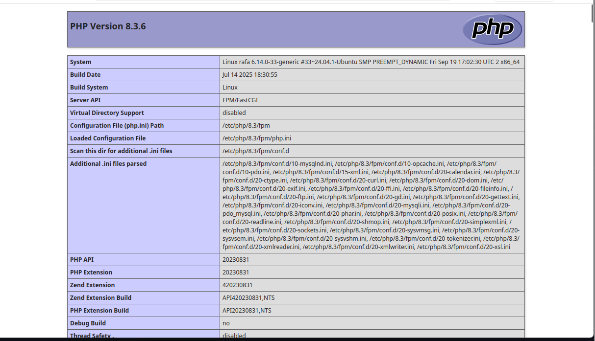

 

Instalar phpMyAdmin:

sudo apt -y install phpmyadmin 
sudo ln -s /usr/share/phpmyadmin /var/www/servidor2.centro.intranet/phpmyadmin 
sudo systemctl reload nginx

 

Acceder: 
http://servidor2.centro.intranet:8080/phpmyadmin

 

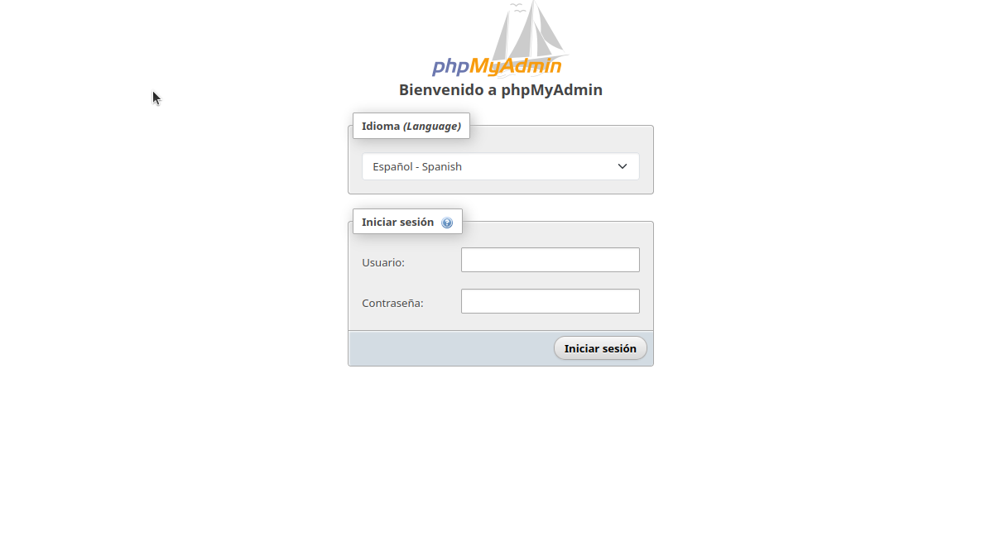

 

9) Comprobaciones y validaciones

Apache sirve WordPress en http://centro.intranet 
Apache sirve app Python en http://departamentos.centro.intranet con autenticación básica 
AWStats accesible en http://centro.intranet/awstats/awstats.pl?config=centro.intranet 
Nginx en http://servidor2.centro.intranet:8080 con PHP y phpMyAdmin

 

Comandos útiles: 
sudo systemctl status apache2 nginx mysql 
sudo tail -f /var/log/apache2/*.log 
sudo tail -f /var/log/nginx/access.log /var/log/nginx/error.log 
curl -I http://centro.intranet 
curl -I http://departamentos.centro.intranet 
curl -I http://servidor2.centro.intranet:8080

 

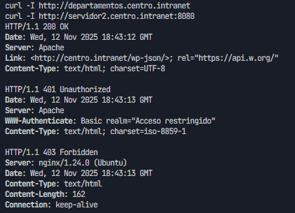 

 

10) Entrega en GitHub

Estructura: 
README.md 
images/ 
docs/ (opcional)

 

Fragmentos de configuración a incluir: 
/etc/hosts 
/etc/apache2/sites-available/centro.intranet.conf 
/etc/apache2/sites-available/departamentos.centro.intranet.conf 
/etc/awstats/awstats.centro.intranet.conf 
/etc/nginx/sites-available/servidor2.centro.intranet 
wsgi.py, app.py, wp-config.php (sin credenciales)

 

Sugerencia de mensajes de commit: 
docs: añade guía paso a paso y estructura de capturas 
feat(apache): vhosts para centro y departamentos 
feat(wordpress): instalación y configuración inicial 
feat(python): app wsgi mínima y autenticación básica 
feat(awstats): configuración sitio centro.intranet 
feat(nginx): server 8080 con php y phpmyadmin

 

Anexos

Rutas clave: 
/etc/hosts — resolución de nombres internos 
/var/www/centro.intranet — WordPress 
/var/www/departamentos.centro.intranet — App Python + WSGI 
/etc/apache2/sites-available/*.conf — VirtualHosts Apache 
/var/log/apache2/*.log — Logs Apache 
/etc/awstats/awstats.centro.intranet.conf — AWStats 
/etc/nginx/sites-available/servidor2.centro.intranet — Server block Nginx 
/var/www/servidor2.centro.intranet — Sitio Nginx con PHP

 

Problemas frecuentes: 
“No carga WordPress”: revisa permisos y wp-config.php 
“Python da 500”: revisa wsgi.py, permisos y error.log 
“AWStats vacío”: verifica LogFile y ejecuta -update 
“Nginx no ejecuta PHP”: confirma socket de php-fpm correcto 
“Visualizar las versiones de PHP”

