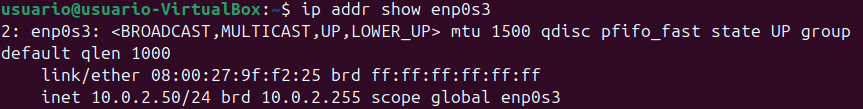
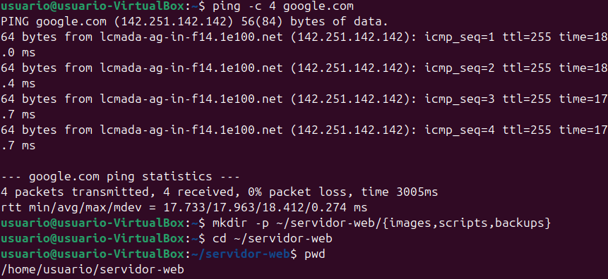
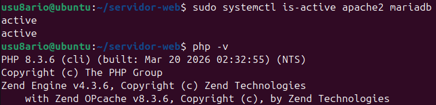
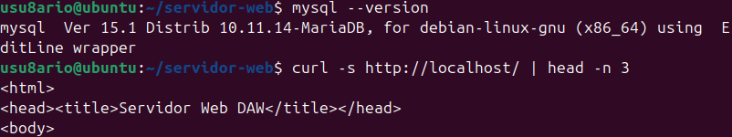
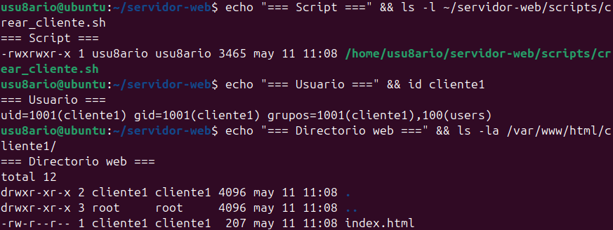
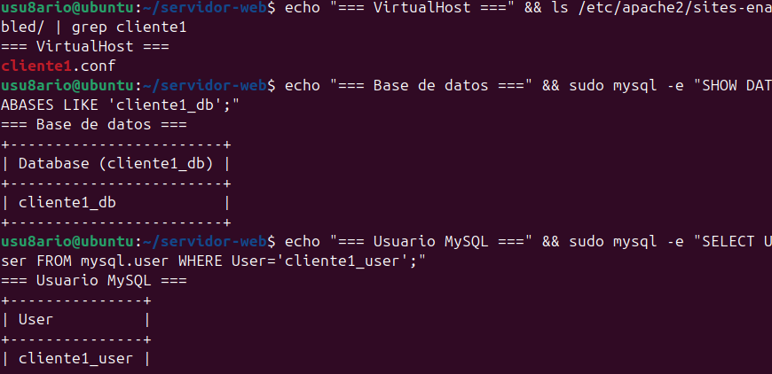
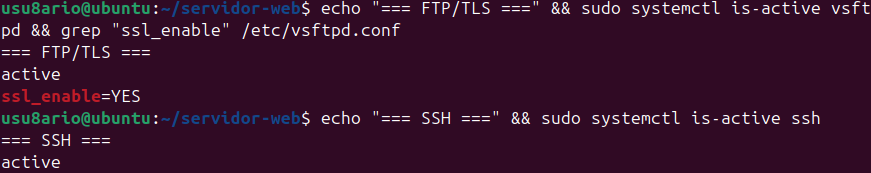
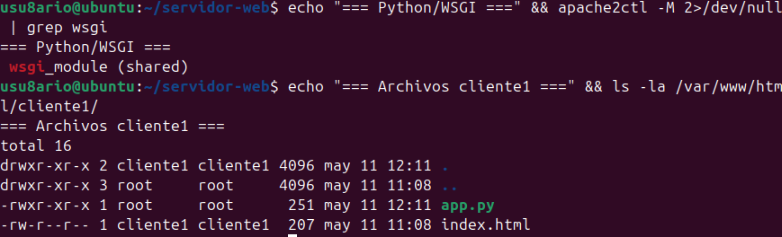
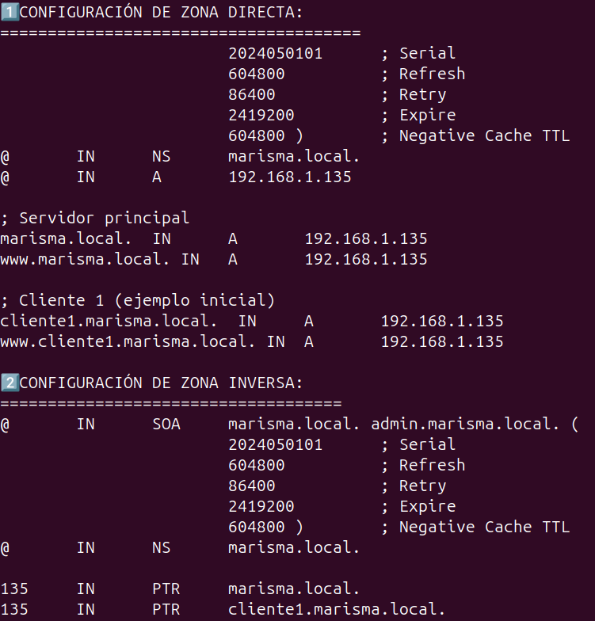
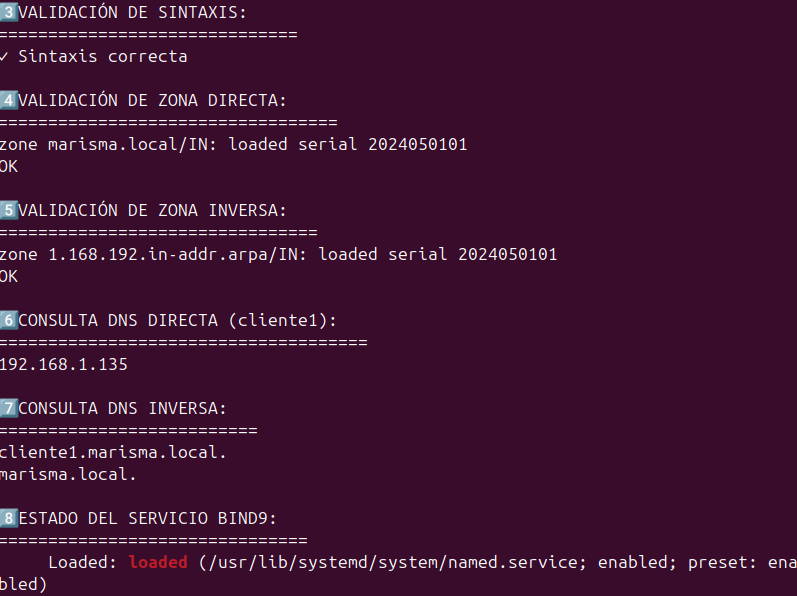

# 🌐 Proyecto Técnico - Infraestructura Web y Servicios de Red (DAW 2025/26)

Autor: Arturo Gutierrez Sanchez
Sistema operativo empleado: Ubuntu Desktop 24.04 LTS ejecutado en VirtualBox
Modo de red: Adaptador puente (Bridged Adapter)
Dirección IP del servidor: 192.168.1.135
Dominio interno: marisma.local
Ruta principal del proyecto: ~/infraestructura-web/

==================================================
ÍNDICE
==================================================

1. Preparación inicial del entorno
2. Instalación de Apache, PHP y MariaDB
3. Automatización de clientes web
4. Configuración de FTP seguro, SSH y Python
5. Implementación del servidor DNS con BIND9
6. Comprobaciones y validaciones finales
7. Uso del entorno configurado
8. Estructura y arquitectura del sistema

==================================================
1. CONFIGURACIÓN INICIAL DEL SISTEMA
==================================================

FINALIDAD

Preparar el entorno Linux actualizando el sistema, instalando utilidades básicas y creando la estructura inicial del proyecto.

COMANDOS EJECUTADOS

sudo apt update && sudo apt upgrade -y

sudo apt install -y \
net-tools curl wget vim git unzip

mkdir -p ~/infraestructura-web/{scripts,images,backups}

cd ~/infraestructura-web

RESULTADO

- Sistema actualizado sin errores.
- Herramientas esenciales instaladas correctamente.
- Conexión de red verificada.
- Directorios del proyecto creados.

==================================================
2. INSTALACIÓN DE APACHE2, PHP Y MARIADB
==================================================

FINALIDAD

Montar un entorno LAMP operativo para alojar aplicaciones web dinámicas y gestionar bases de datos usando phpMyAdmin.

INSTALACIÓN DE PAQUETES

sudo apt install -y apache2 mariadb-server mariadb-client \
php php-cli php-mysql php-curl php-gd php-xml php-mbstring php-zip \
libapache2-mod-php phpmyadmin

CONFIGURACIÓN COMPLEMENTARIA

sudo systemctl enable apache2 mariadb
sudo systemctl start apache2 mariadb

sudo a2enmod rewrite ssl
sudo systemctl restart apache2

sudo ln -s /etc/phpmyadmin/apache.conf \
/etc/apache2/conf-available/phpmyadmin.conf

sudo a2enconf phpmyadmin
sudo systemctl reload apache2

RESULTADO

- Apache2 funcionando en el puerto 80.
- PHP 8.3 correctamente integrado.
- Servicio MariaDB operativo.
- phpMyAdmin accesible desde el navegador.

==================================================
3. AUTOMATIZACIÓN DE CREACIÓN DE CLIENTES
==================================================

FINALIDAD

Crear un script capaz de automatizar el alta de clientes web incluyendo todos los servicios necesarios.

SCRIPT UTILIZADO

~/infraestructura-web/scripts/crear_cliente.sh

EJECUCIÓN DEL SCRIPT

sudo ./crear_cliente.sh cliente1 192.168.1.135

PROCESOS AUTOMATIZADOS

- Creación de usuarios Linux.
- Generación de directorios web personalizados.
- Creación automática de páginas iniciales.
- Configuración de VirtualHosts en Apache.
- Registro automático en DNS.
- Creación de bases de datos MySQL.
- Generación de contraseñas seguras.

==================================================
4. FTP SEGURO, SSH/SFTP Y SOPORTE PYTHON
==================================================

FINALIDAD

Permitir acceso remoto seguro y habilitar soporte para aplicaciones Python ejecutadas desde Apache.

INSTALACIÓN

sudo apt install -y \
vsftpd \
openssh-server \
libapache2-mod-wsgi-py3

CONFIGURACIÓN DE FTP

Archivo utilizado:

/etc/vsftpd.conf

Opciones activadas:

ssl_enable=YES
chroot_local_user=YES

CONFIGURACIÓN DEL FIREWALL

sudo ufw allow 21/tcp
sudo ufw allow 22/tcp
sudo ufw allow 40000:40100/tcp

ACTIVACIÓN DE SOPORTE PYTHON

sudo a2enmod wsgi
sudo systemctl reload apache2

RESULTADO

- FTP protegido mediante TLS.
- SSH y SFTP funcionando correctamente.
- Compatibilidad con aplicaciones Python vía mod_wsgi.

==================================================
5. CONFIGURACIÓN DNS CON BIND9
==================================================

FINALIDAD

Implementar un servidor DNS local autoritativo con resolución directa e inversa.

INSTALACIÓN DE PAQUETES

sudo apt install -y \
bind9 bind9-utils bind9-doc dnsutils

CONFIGURACIÓN PRINCIPAL

Archivo utilizado:

/etc/bind/named.conf.local

ZONAS DNS CREADAS

- marisma.local
- 1.168.192.in-addr.arpa

VALIDACIONES REALIZADAS

sudo named-checkconf

sudo named-checkzone marisma.local \
/etc/bind/db.marisma.local

PRUEBAS DNS

dig @192.168.1.135 cliente1.marisma.local

dig @192.168.1.135 -x 192.168.1.135

RESULTADO

- Resolución directa operativa.
- Resolución inversa funcionando correctamente.
- Integración automática con el script de clientes.

==================================================
6. COMPROBACIÓN COMPLETA DEL SISTEMA
==================================================

VERIFICACIÓN DE SERVICIOS

sudo systemctl status \
apache2 mariadb named vsftpd ssh

PRUEBA HTTP

curl http://192.168.1.135

VERIFICACIÓN DE BASES DE DATOS

sudo mysql -e "SHOW DATABASES;"

COMPROBACIÓN DNS

dig @192.168.1.135 cliente1.marisma.local +short

PRUEBA SSH

ssh cliente1@192.168.1.135

RESULTADO FINAL

Todos los servicios quedaron funcionando correctamente y totalmente integrados entre sí.

==================================================
7. USO PRÁCTICO DEL SERVIDOR
==================================================

CREAR UN NUEVO CLIENTE

sudo ~/infraestructura-web/scripts/crear_cliente.sh empresa 192.168.1.135

EL SISTEMA CREA AUTOMÁTICAMENTE

- Usuario Linux
- Carpeta web personalizada
- VirtualHost Apache
- Subdominio DNS
- Base de datos MySQL
- Usuario para MySQL
- Contraseña segura aleatoria

==================================================
ACCESO A LOS SERVICIOS
==================================================

PÁGINA WEB DEL CLIENTE

http://empresa.marisma.local

PHPMYADMIN

http://192.168.1.135/phpmyadmin

CONEXIÓN SSH

ssh empresa@192.168.1.135

CONEXIÓN SFTP

sftp empresa@192.168.1.135

==================================================
8. ARQUITECTURA DEL ENTORNO DESPLEGADO
==================================================

| Servicio        | Tecnología | Puerto   |
|-----------------|------------|-----------|
| Servidor web    | Apache2    | 80 / 443 |
| Lenguaje backend| PHP 8.3    | Interno   |
| Base de datos   | MariaDB    | 3306      |
| DNS             | BIND9      | 53        |
| FTP seguro      | vsftpd     | 21        |
| Acceso remoto   | OpenSSH    | 22        |
| Soporte Python  | mod_wsgi   | Apache    |

==================================================
MEDIDAS DE SEGURIDAD IMPLEMENTADAS
==================================================

- FTP protegido mediante TLS.
- Usuarios restringidos con chroot.
- Acceso remoto seguro con SSH/SFTP.
- Contraseñas aleatorias seguras.
- Bases de datos separadas por cliente.
- Verificación automática de zonas DNS.
- Permisos seguros en directorios web.

==================================================
ORGANIZACIÓN DEL PROYECTO
==================================================

~/infraestructura-web/
├── README.md
├── scripts/
├── images/
└── backups/

==================================================
OBJETIVOS COMPLETADOS
==================================================

✔ Instalación de servidor web configurable
✔ Hosting de sitios estáticos y dinámicos
✔ Automatización mediante scripts
✔ Configuración de servidor DNS local
✔ Integración MariaDB y phpMyAdmin
✔ FTP seguro mediante TLS
✔ Acceso SSH y SFTP funcional
✔ Soporte para aplicaciones Python
✔ Configuración automática de VirtualHosts
✔ Gestión multiusuario

==================================================
INFORMACIÓN DEL ENTORNO
==================================================

- Ubuntu 24.04 LTS
- VirtualBox
- Red configurada en modo puente
- Arquitectura x86_64
- Dominio local: marisma.local

==================================================
ESTADO FINAL DEL PROYECTO
==================================================

| Elemento              | Estado          |
|-----------------------|-----------------|
| Apache configurado    | ✅ Correcto     |
| DNS operativo         | ✅ Correcto     |
| Bases de datos        | ✅ Funcionando  |
| VirtualHosts          | ✅ Activos      |
| FTP y SSH             | ✅ Operativos   |
| Automatización        | ✅ Implementada |
